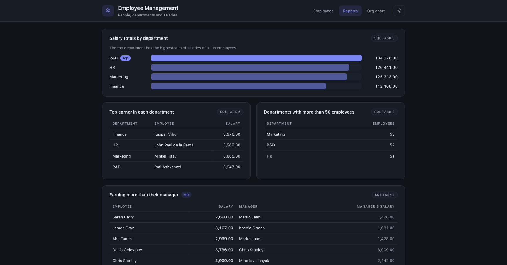
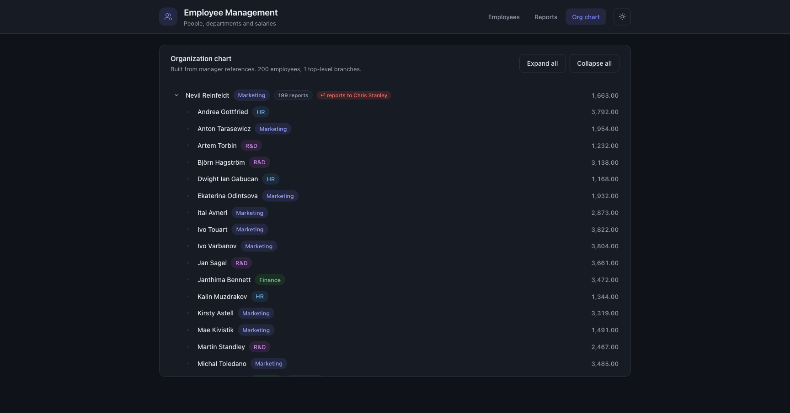

# Employee Management

Test assignment: a web application for managing employees, departments, managers and salaries.

| Layer    | Tech                                            |
|----------|-------------------------------------------------|
| Backend  | C#, ASP.NET Core Web API (.NET 10), EF Core     |
| Frontend | Angular 20 (standalone components, signals)     |
| Database | MS SQL Server, restored from `TestDB.bak`       |

| Light | Dark |
|-------|------|
|  |  |

| Reports (the SQL tasks, live) | Org chart |
|-------------------------------|-----------|
|  |  |

## Features

- Employee table: name, surname, department, manager's full name, salary
- Full CRUD: create, edit and delete employees
- Department and manager selection through searchable dropdowns
- Sorting by any column (asc → desc → off) and filtering by department / manager + full-text search
- Business rules enforced on the server:
  - an employee cannot be a manager of himself (HTTP 400)
  - an employee who manages other employees cannot be deleted (HTTP 409) —
    the UI turns this into a **reassignment wizard**: pick a new manager for
    his team and everything happens in one transaction
  - department / manager references are validated
- **Reports page** — the five SQL tasks rendered live from the API (bar chart + tables)
- **Org chart** — the management hierarchy as an expandable tree; management
  cycles present in TestDB (e.g. 1 → 7 → 10 → 1) are detected and broken visibly
- Light and dark themes (auto-detected from the OS, toggleable, persisted)
- Search-match highlighting, accessible dialogs (focus trap, Escape, ARIA)
- SQL tasks: [`sql/queries.sql`](sql/queries.sql), verified against the restored `TestDB`
- Unit tests on both sides + GitHub Actions CI

## Project structure

```
backend/        ASP.NET Core Web API (EF Core, controllers, DTOs)
backend.Tests/  xUnit tests (business rules + reports on in-memory SQLite)
frontend/       Angular application (+ Karma unit tests)
database/       TestDB.bak + restore script
sql/            queries.sql — the 5 SQL tasks
```

## Getting started

### Prerequisites

| Tool | Version | Check with |
|------|---------|------------|
| Docker Desktop | any recent | `docker --version` |
| .NET SDK | 10.x | `dotnet --version` |
| Node.js | 20.19+ (or 22+) | `node --version` |

On Apple Silicon the SQL Server image runs via Rosetta emulation
(`platform: linux/amd64` is already set in `docker-compose.yml`).

### 1. Database

With Docker (recommended):

```bash
docker compose up -d          # starts SQL Server 2022 on localhost,1433
./database/restore.sh         # restores TestDB from the backup
```

`restore.sh` is idempotent — run it again at any time to reset the data back
to the original 200 employees.

Or restore `database/TestDB.bak` on your own SQL Server instance and adjust
the connection string in `backend/appsettings.json`.

### 2. Backend

```bash
cd backend
dotnet run                    # API on http://localhost:5080
```

Sanity check: `curl http://localhost:5080/api/departments` should return 4 departments.

### 3. Frontend

```bash
cd frontend
npm install
npm start                     # UI on http://localhost:4200
```

Open http://localhost:4200 — you should see a table with 200 employees.

## Manual testing checklist

Everything from the assignment can be verified through the UI:

1. **Table** — name, surname, department, manager's full name and salary
   for every employee; click column headers to sort (third click resets),
   use the search box and the department/manager filters.
2. **Create** — "Add employee", fill the form; department and manager are
   dropdowns with search. The employee appears in the table.
3. **Edit** — pencil icon on a row; change any field including department
   and manager. A renamed manager updates in his subordinates' rows too.
4. **Self-manager rule** — edit any employee and try to pick him as his own
   manager: he is not present in his own manager dropdown. The rule is also
   enforced server-side (400), which the API tests cover.
5. **Delete a regular employee** — trash icon → confirm; the row disappears.
6. **Delete a manager** — try deleting someone from the Manager column
   (e.g. Chris Stanley): the dialog explains he manages N employees and asks
   for a new manager for his team; "Reassign & delete" moves them and deletes
   him in one transaction. (The raw API without `reassignTo` returns 409.)
7. **Reports** — the Reports tab renders all five SQL tasks live: salary
   totals by department, top earners, large departments, and the two
   manager-comparison lists.
8. **Org chart** — the Org chart tab shows the management tree with expand /
   collapse; the badge "↩ reports to …" marks where a management cycle in the
   data was broken.
9. **Themes** — the sun/moon button in the header toggles light/dark;
   the choice survives a page reload.
10. **SQL tasks** — run [`sql/queries.sql`](sql/queries.sql) against the
    restored database, e.g.:

   ```bash
   docker exec -i testdb-mssql /opt/mssql-tools18/bin/sqlcmd \
     -S localhost -U sa -P 'TestDb!Passw0rd' -C -W < sql/queries.sql
   ```

## API

| Method | Route                  | Description                                  |
|--------|------------------------|----------------------------------------------|
| GET    | `/api/employees`       | List employees with department/manager names |
| GET    | `/api/employees/{id}`  | Single employee                              |
| POST   | `/api/employees`       | Create employee                              |
| PUT    | `/api/employees/{id}`  | Update employee                              |
| DELETE | `/api/employees/{id}?reassignTo=id\|none` | Delete employee; 409 if he manages someone and no `reassignTo` is given, otherwise his team is moved atomically |
| GET    | `/api/departments`     | List departments                             |
| GET    | `/api/reports/salary-above-manager` | SQL task 1 |
| GET    | `/api/reports/top-earners` | SQL task 2 |
| GET    | `/api/reports/large-departments?minEmployees=50` | SQL task 3 |
| GET    | `/api/reports/cross-department-managers` | SQL task 4 |
| GET    | `/api/reports/department-salary-totals` | SQL task 5 |

## Tests

```bash
dotnet test                                              # backend (21 tests)
cd frontend && npx ng test --watch=false --browsers=ChromeHeadless   # frontend (17 tests)
```

Both suites also run in CI on every push (`.github/workflows/ci.yml`).

## Notes on the data model

`TestDB` stores the full name in a single `Employee.Name` column and has no
first/last name split. To keep the original database untouched (so the app and
the SQL tasks run against a pristine restore of `TestDB.bak`), the API splits
the name by convention — the first word is the first name, the rest is the
surname — and joins it back on save. See `backend/Services/NameParser.cs`.

## SQL tasks

All five queries live in [`sql/queries.sql`](sql/queries.sql):

1. Employees whose salary is higher than their manager's salary
2. The employee with the highest salary in each department
3. Departments with more than 50 employees
4. Employees whose manager is in a different department
5. The department with the highest sum of salaries

## Design decisions & trade-offs

- **Client-side sorting/filtering/search.** The dataset is small (~200 rows), so
  the API returns everything and the UI stays instant. With larger data the
  list endpoint would grow server-side paging/sorting parameters.
- **No FK constraints in TestDB.** The schema is kept as shipped, so the
  "cannot delete a manager" check runs inside a serializable transaction to
  stay correct under concurrent writes.
- **Secrets in the repo** (`sa` password) are intentional to make the reviewer
  setup one-command; in a real project they would live in user secrets /
  environment variables, and the app would not connect as `sa`.
- **No service layer.** Controllers talk to the DbContext directly — at this
  size an extra layer would be ceremony; the frontend's state logic is however
  extracted into `EmployeeStore` because dialogs/toasts made the root
  component grow past comfortable limits.
