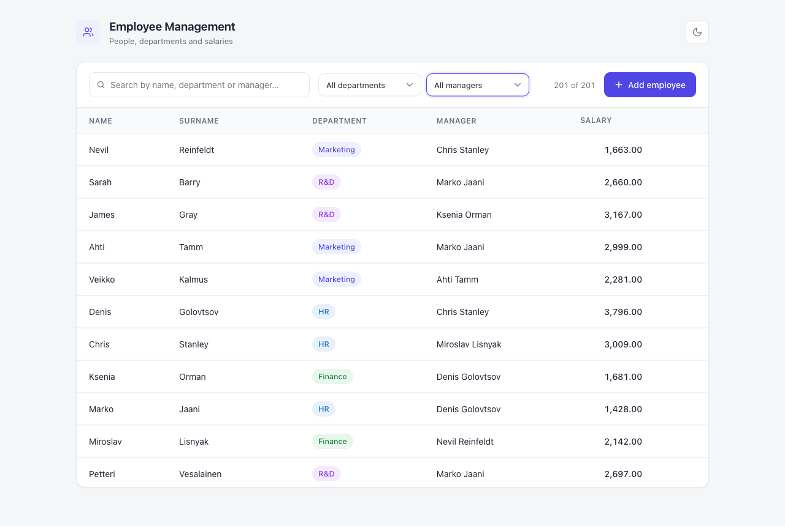
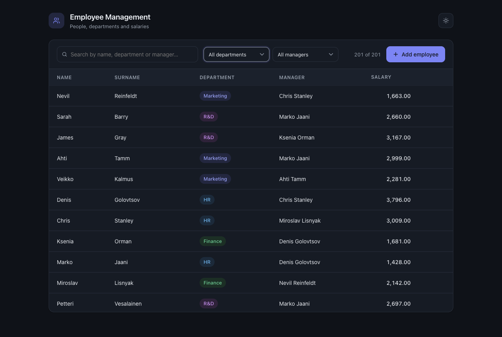

# Employee Management

Test assignment: a web application for managing employees, departments, managers and salaries.

| Layer    | Tech                                            |
|----------|-------------------------------------------------|
| Backend  | C#, ASP.NET Core Web API (.NET 10), EF Core     |
| Frontend | Angular 20 (standalone components, signals)     |
| Database | MS SQL Server, restored from `TestDB.bak`       |

| Light | Dark |
|-------|------|
|  |  |

## Features

- Employee table: name, surname, department, manager's full name, salary
- Full CRUD: create, edit and delete employees
- Department and manager selection through dropdowns
- Sorting by any column (asc → desc → off) and filtering by department / manager + full-text search
- Business rules enforced on the server:
  - an employee cannot be a manager of himself (HTTP 400)
  - an employee who manages other employees cannot be deleted — the UI shows the reason (HTTP 409)
  - department / manager references are validated
- Light and dark themes (auto-detected from the OS, toggleable, persisted)
- Search-match highlighting, accessible dialogs (focus trap, Escape, ARIA)
- SQL tasks: [`sql/queries.sql`](sql/queries.sql), verified against the restored `TestDB`
- Unit tests on both sides + GitHub Actions CI

## Project structure

```
backend/        ASP.NET Core Web API (EF Core, controllers, DTOs)
backend.Tests/  xUnit tests (business rules on in-memory SQLite)
frontend/       Angular application (+ Karma unit tests)
database/       TestDB.bak + restore script
sql/            queries.sql — the 5 SQL tasks
```

## Getting started

### 1. Database

With Docker (recommended):

```bash
docker compose up -d          # starts SQL Server 2022 on localhost,1433
./database/restore.sh         # restores TestDB from the backup
```

Or restore `database/TestDB.bak` on your own SQL Server instance and adjust
the connection string in `backend/appsettings.json`.

### 2. Backend

```bash
cd backend
dotnet run                    # http://localhost:5080
```

### 3. Frontend

```bash
cd frontend
npm install
npm start                     # http://localhost:4200
```

## API

| Method | Route                  | Description                                  |
|--------|------------------------|----------------------------------------------|
| GET    | `/api/employees`       | List employees with department/manager names |
| GET    | `/api/employees/{id}`  | Single employee                              |
| POST   | `/api/employees`       | Create employee                              |
| PUT    | `/api/employees/{id}`  | Update employee                              |
| DELETE | `/api/employees/{id}`  | Delete employee (409 if he manages someone)  |
| GET    | `/api/departments`     | List departments                             |

## Tests

```bash
dotnet test                                              # backend (21 tests)
cd frontend && npx ng test --watch=false --browsers=ChromeHeadless   # frontend (17 tests)
```

Both suites also run in CI on every push (`.github/workflows/ci.yml`).

## Notes on the data model

`TestDB` stores the full name in a single `Employee.Name` column and has no
first/last name split. To keep the original database untouched (so the app and
the SQL tasks run against a pristine restore of `TestDB.bak`), the API splits
the name by convention — the first word is the first name, the rest is the
surname — and joins it back on save. See `backend/Services/NameParser.cs`.

## SQL tasks

All five queries live in [`sql/queries.sql`](sql/queries.sql):

1. Employees whose salary is higher than their manager's salary
2. The employee with the highest salary in each department
3. Departments with more than 50 employees
4. Employees whose manager is in a different department
5. The department with the highest sum of salaries

## Design decisions & trade-offs

- **Client-side sorting/filtering/search.** The dataset is small (~200 rows), so
  the API returns everything and the UI stays instant. With larger data the
  list endpoint would grow server-side paging/sorting parameters.
- **No FK constraints in TestDB.** The schema is kept as shipped, so the
  "cannot delete a manager" check runs inside a serializable transaction to
  stay correct under concurrent writes.
- **Secrets in the repo** (`sa` password) are intentional to make the reviewer
  setup one-command; in a real project they would live in user secrets /
  environment variables, and the app would not connect as `sa`.
- **No service layer.** Controllers talk to the DbContext directly — at this
  size an extra layer would be ceremony; the frontend's state logic is however
  extracted into `EmployeeStore` because dialogs/toasts made the root
  component grow past comfortable limits.
